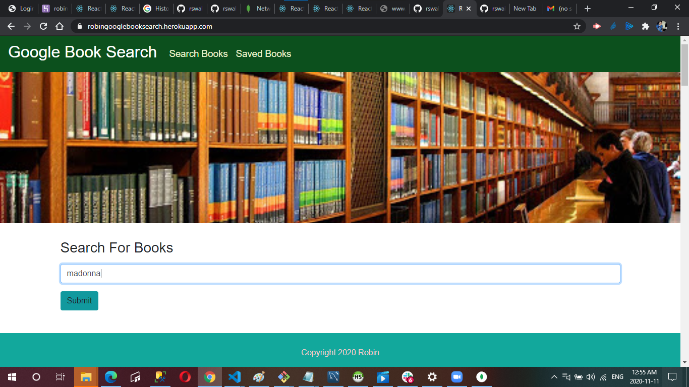
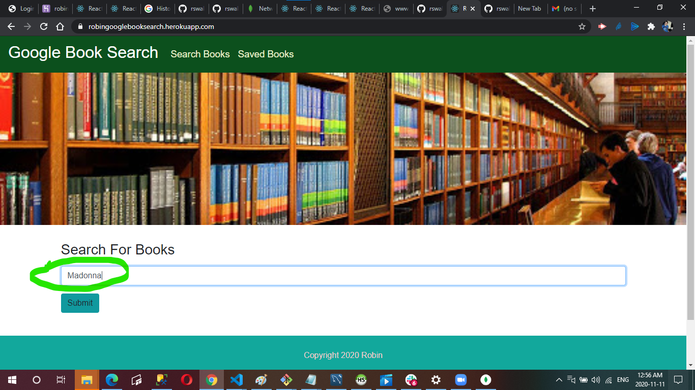
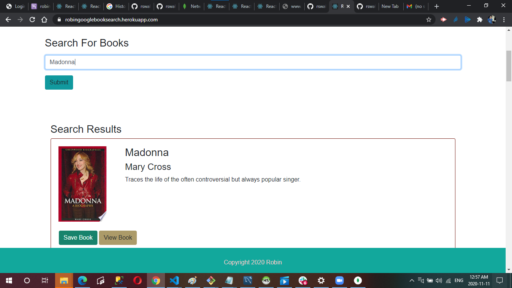
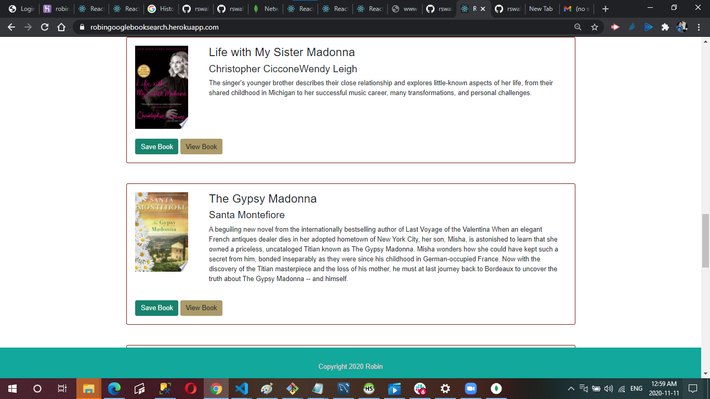
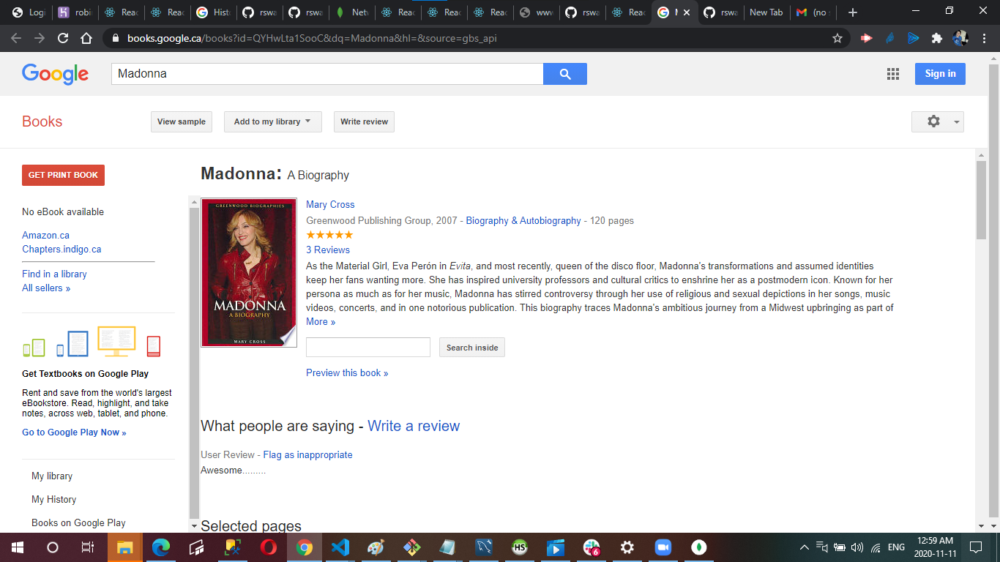

# Google Books React Search

 I have created a React-based Google Books Search app with React components to work with helper/util functions, and utilize React lifecycle methods to query and display books based on user searches. This app uses Node, Express and MongoDB so that users can save books to review or purchase later. The User can search for books via the Google Books API and save them. The User has the option to "View" a book, bringing them to the book on Google Books, or "Save" a book, saving it to the Mongo database. The User has an option to "View" the book, bringing them to the book on Google Books, or "Delete" a book, removing it from the Mongo database. I have usedd code to connect to a MongoDB database named "googlebooks" using the mongoose npm package and created a Book schema. Also i have created React Components for the pages "Search` and `Saved`.

 # ScreenShots

 
 
 
 
 

 # Deployed Heroku App

 https://robingooglebooksearch.herokuapp.com/

 # Github Repository

 https://github.com/rswalm/RobinGoogleBookSearch/
 
